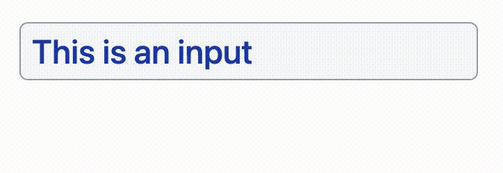

# react-line-wrapping-input



`<input type="text">` elements don't wrap nor adjust their size to the content.

`<textarea>` elements wrap, but don't adjust their size to the content, and they allow line breaks.

What about an input that **wraps** when the content is too long, but **doesn't** allow user-entered line breaks?

No easy way to do that natively on the web. This package solves that using a neat trick and a `textarea` element. No need to mess around with `contenteditable`.

**[Live demo](https://codesandbox.io/s/react-line-wrapping-input-examples-k53r2b)**

## Installation

```
npm install --save react-line-wrapping-input
```

## Usage

```js
import LineWrappingInput from "react-line-wrapping-input";
```

```js
<LineWrappingInput
  {/*
    No required props.
    You'll probably want value and onChange for controlled inputs.
    You can also use onBlur and any other textarea props.
    There are some custom props too, see below.
  */}
/>
```

### Required styles

Because of browser default styles, some CSS resets are required.

```css
.line-wrapping-input {
  border: 0; /* add a border on the container if you want one */
  background: "transparent"; /* add a background on the container if you want one */
  text-align: "left"; /* you may also use right or center here */
  padding: 0; /* change 0 for your desired padding */
  font: "inherit"; /* you may set a font here if you wish */
}
```

Pasting the snippet into your CSS file will work, but you can use custom classes or inline styles instead if you prefer (read the **Styling** section).

## How it works

It renders a `div` element with two overlapping children: a `textarea` and another `div`. The inner `div` renders the textarea's content too (but it's invisible!), and since divs automatically resize according to their content, the textarea does as well.

This solution is inspired by [this CSS tricks article](https://css-tricks.com/the-cleanest-trick-for-autogrowing-textareas/), with the added feature of emulating a single-line input by stripping line breaks.

## Styling

You can add CSS rules to the built-in classes, supply your own, or use inline styles.

### Built-in classes:

- Use the `.line-wrapping-input-container` selector to style the container.
- Use the `.line-wrapping-input` selecctor to style the textarea and the invisible element.

### Add your own classes:

- Use the `containerClassName` prop to add classes to the container.
- Use the `className` prop to add classes to the textarea and the invisible element.

### Inline styles:

- Use the `containerStyle` prop to add styles to the container.
- Use the `style` prop to add styles to the textarea and the invisible element.

> A way to style just the `textarea` or the invisible element is not provided. The autosizing would break if they don't have matching styles.

> Some more inline styles will be added by the package, those are required for the component to work.

## Custom props

Apart from all textarea props except for `rows`, there are a few extra features you can take advantage of.

### blurOnLineBreak

Set `blurOnLineBreak={true}` to blur the input when the user presses the `return` key. Otherwise, the return key will move the cursor to the end of the content.

> On regular HTML text inputs, the return key doesn't jump to the end, but I've found no way to prevent this.

<!-- TODO find a way to prevent return key behavior -->

### onReturn

If you want to do anything else when the user presses the return key (for example, submitting data), use the `onReturn` event.

### suffix

The `suffix` prop renders some optional static text after the editable portion of the input. It can be useful for fields with units, such as "\_\_\_ minutes".

The suffix is rendered in a `span` tag. Use the `.line-wrapping-input-suffix` selector, the `suffixStyle` prop and/or the `suffixClassName` prop to style it if you need to.

### readOnly

In addition to the standard `disabled` prop, a `readOnly` boolean prop is included. This will unmount the `textarea` and show the static content instead. It can be useful when a disabled field is not desirable or if distinct _read-only_ and _disabled_ states are required.

### ref

The `ref` to the textarea element is exposed via `forwardRef`, if you need to access it for some reason.

### overlapTechnique

To overlap the textarea and the invisible element, the default behavior is to use `display: grid` and overlapping grid areas. An equivalent result can be achieved with absolute positioning. If you prefer that you can use `overlapTechnique="absolute"`.

## Tricks

### Growing the field horizontally

If you set the container element (`.line-wrapping-input-container`) to have `width: fit-content`, you'll get an input that expands horizontally up to its `max-width` (if one is set) and then wraps over to the next line.

Use `overlapTechnique="absolute"` for best results.

### Maximum rows

There's no straightforward way to set the maximum amount of rows for the input, but there's a trick you can use.

Set `max-height` and `overflow: auto` on the container element (using the `.line-wrapping-input-container` selector, the `containerClassName` prop or the `containerStyle` prop). The max-height should match the height that your maximum lines would have.

Make sure your padding is on the input and your border is on the container, that way the scrolling behavior will look better.

**How to get the correct max-height value**

If you're using an absolute value for `line-height`, you'll need `max-height: PADDING_TOP + PADDING_BOTTOM + BORDER_TOP + BORDER_BOTTOM + DESIRED_MAX_LINES * LINE_HEIGHT`.

If you're using a relative value for `line-height`, your absolute line height is `LINE_HEIGHT` times `FONT_SIZE`.

You can use `calc()` if you need to mix units or reference CSS variables.

## Known issues

### text-align and suffix

The `suffix` prop will not display correctly when using `text-align: center` or `text-align: right`.
